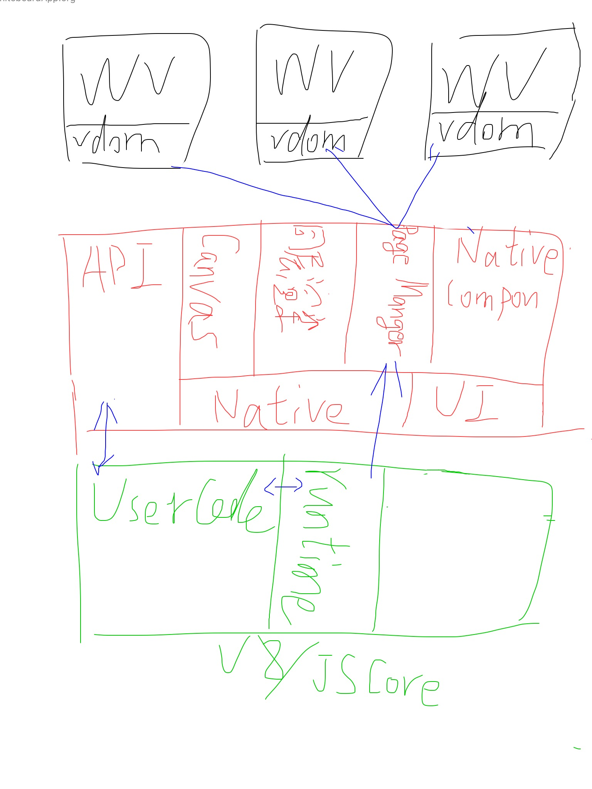

# NiuMiniProgram
基于Android平台实现的小程序架构系统

### 基本架构
画了张草图，凑合看看（可能后面所有的图都会比较随性的画:sweat_smile:） 
所以我猜测微信小程序看起来好像是双线程，但实际上webview这个东西本身就不在主线程运行，实际上每次通信应该是*logic(逻辑线程) -> native(主线程) -> UI(webview)*。  
由于这里可能涉及前端项目的设计，所以在这里先大概说一下我的思路：前端通过自定义编译器，将用户的html+css编译成对应的静态文件(可能后期会考虑直接编译成Vdom或者使用Svelte这种更轻的类库)，将所有页面的js文件编译到一个文件中，放到Logic线程中去运行，这样就会实现我们对用户代码的安全隔离和分线程运行。Logic线程通过类似于setData方法触发向Webview发送数据，但是实际上是向Native发送，然后Native通过PageManager转发给对应的Webview，反向通信则是Webview调用Native预设的Interface，直接向Logic线程发送广播即可。  
Webview后期可能会采用X5内核，而Logic线程则是使用的V8(J2V8)引擎来运行(参考文章：<a
href="https://neyoufan.github.io/2016/12/23/android/Android%20Js引擎/在Android上使用JS引擎是一种什么样的体验？/">在Android上使用JS引擎是一种什么样的体验？</a>)  

### 应用生命周期与事件分发

### 参考文章：
<a href="https://zhuanlan.zhihu.com/p/81775922">小程序底层实现原理及一些思考</a>  
<a href="https://neyoufan.github.io/2016/12/23/android/Android%20Js引擎/在Android上使用JS引擎是一种什么样的体验？/">在Android上使用JS引擎是一种什么样的体验？</a>

### License
MIT